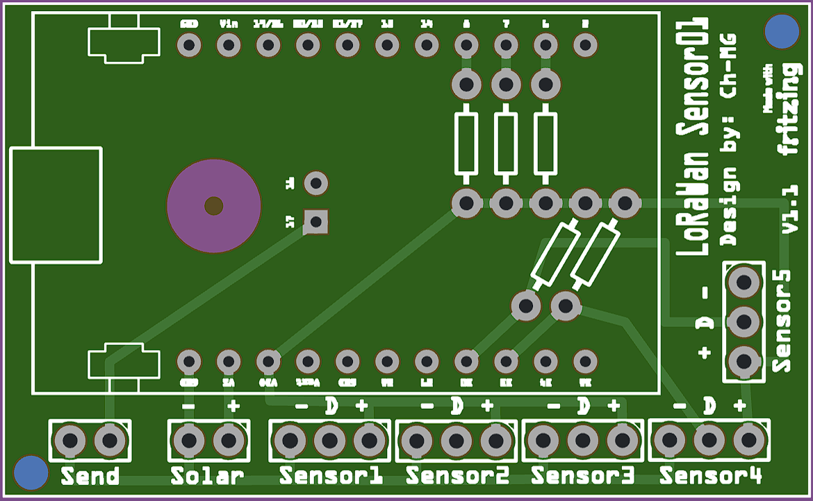

# LoRaWan_Sensor01 V1.1 (CubeCell AB01, DS18B20 + DHT22 + Reed)

## Hardware
- Heltec CubeCell AB01
- DS18B20
- DHT22
- Reed Kontakt (LOW = geschlossen)

## Platinenlayout
- Das Platinen-Design liegt im Ordner `Fritzing` in der Datei `LoRaWan_Sensor01.fzz`.
- Direkt bestellen (Aisler): https://aisler.net/p/UXGEYAMX
- Anschluss `Sensor[1-5]` = `DHT22, DS18B20 oder Reed Kontakt`
- Anschluss `Temp2` = `DS18B20`
- Anschluss `Send` = `Sofort-Senden Trigger`
- Anschluss `Solar` = `Solar Modul für Batterieladung`
- Alle Widerstände sind PullUp mit `4,7k`



## Verdrahtung (Vorschlag / Verwendet bei Platine)
> Passe die Pins bei Bedarf im Sketch an.

- Sensor1 -> `GPIO3`
- Sensor2 -> `GPIO2`
- Sensor3 -> `GPIO1`
- Sensor4 -> `GPIO5`
- Sensor5 -> `GPIO0`
- Sofort-Senden Trigger -> `GPIO7`

Zusätzlich:
- DS18B20: 4.7k Pullup zwischen Data und 3V3
- DHT22: je nach Modul oft schon Pullup vorhanden, sonst 10k zwischen Data und 3V3
- Reedkontakte jeweils zwischen GPIO und GND (im Sketch `INPUT_PULLUP`, daher aktiv LOW)

## Software (PlatformIO)
1. VS Code + PlatformIO IDE Extension installieren
2. Projekt öffnen (Ordner mit `platformio.ini`)
3. Alle Projektvariablen in `platformio.ini` setzen (unter `build_flags`):
  - LoRa Keys (`LORA_DEV_EUI`, `LORA_APP_EUI`, `LORA_APP_KEY`)
  - Sensor-Pins (`PIN_SENSOR1..5`)
  - Standard-Typen pro Pin (`SENSOR1_TYPE..SENSOR5_TYPE`, Standard: alle `SENSOR_TYPE_REED`)
  - Downlink Konfig-Port (`CFG_CONFIG_PORT`, Standard `100`)
  - Timing (`CFG_TX_DUTY_MS`, `REED_EVENT_COOLDOWN_MS`)
4. LoRa-Region in `platformio.ini` setzen (z. B. `board_build.arduino.lorawan.region = EU868`)
5. Build/Flash/Monitor starten:
  - Build: `pio run`
  - Upload: `pio run -t upload`
  - Monitor: `pio device monitor -b 115200`

Genutzte Board-Konfiguration:
- `platform = heltec-cubecell`
- `board = cubecell_board` (HTCC-AB01)
- `framework = arduino`

## WSL: USB verbinden und Upload testen

Wenn das Board in WSL nicht als `/dev/ttyUSB*` oder `/dev/ttyACM*` erscheint:

1. Unter Windows (PowerShell als Administrator) Gerät an WSL anhängen:
  - `usbipd list`
  - `usbipd bind --busid <BUSID>`
  - `usbipd attach --wsl --busid <BUSID>`
2. In WSL serielle Treiber laden:
  - `sudo modprobe usbserial`
  - `sudo modprobe cp210x`
3. Port prüfen:
  - `ls /dev/ttyUSB* /dev/ttyACM*`

Praktische Helfer im Projekt:
- Upload (Auto-Port): `./upload.sh`
- Upload (explizit): `./upload.sh LoRaWan_Sensor01 /dev/ttyUSB0`
- Monitor (Auto-Port, 115200): `./monitor.sh`
- Monitor (explizit): `./monitor.sh 115200 /dev/ttyUSB0`

Hinweis: Bei `Permission denied` auf `/dev/ttyUSB0` hilft testweise:
- `sudo chmod 666 /dev/ttyUSB0`

## Uplink Payload (Port 2)
27 Byte insgesamt:

- Byte 0..1: Akku-Spannung als `uint16`, Einheit: `mV`, Big Endian
- Danach 5 Sensor-Blöcke à 5 Byte (für `Sensor1..Sensor5`):
  - `B0`: Sensor-Typ (`0=None`, `1=DHT22`, `2=DS18B20`, `3=REED`)
  - `B1`: Statusbits pro Slot
    - `bit0`: Temperatur gültig
    - `bit1`: Luftfeuchte gültig
    - `bit2`: Reed-Wert gültig
    - `bit3`: Reed geschlossen
  - `B2..B3`: Temperatur als `int16`, Einheit `°C * 100`, Big Endian (`INT16_MIN` wenn nicht genutzt/ungültig)
  - `B4`: Slot-Daten
    - DHT22: Luftfeuchte als `uint8`, `% * 2` (0.5%-Schritte), `0xFF` ungültig
    - DS18B20: `0xFF` (reserviert)
    - REED: `0` (offen) oder `1` (geschlossen)

## Decoder (z. B. TTN v3)
Der vollständige Decoder liegt in [ttn/decoder.js](ttn/decoder.js).

Für TTN v3 in **Payload Formatters → Uplink** einfach den Inhalt aus dieser Datei einfügen.

Damit erhält jeder Sensor-Slot einen eigenen Block, und die Auswertung funktioniert unabhängig davon, ob z. B. alle 5 Slots DHT22, DS18B20 oder REED sind.

## Sensor-Typen per TTN Downlink ändern (persistent)
- Standard beim Erststart: alle 5 Sensor-Slots sind `SENSOR_TYPE_REED`.
- Downlink-Port: `CFG_CONFIG_PORT` (Standard `100`).

- Payload-Format zum Setzen aller 5 Typen:
  - Variante A (direkt): 5 Byte = `type1,type2,type3,type4,type5`
  - Variante B (mit Command): 6 Byte = `0x01,type1,type2,type3,type4,type5`

Typwert-Mapping:

| Typwert | Sensortyp |
|---|---|
| `0` | `NONE` |
| `1` | `DHT22` |
| `2` | `DS18B20` |
| `3` | `REED` |

- Die Konfiguration wird im internen Speicher abgelegt und ist nach Reboot weiterhin aktiv.

| Hex | Wirkung | Beispielpayload |
|---|---|---|
| `0x01` | Sensor-Typen setzen | `01 03 03 03 02 01` |

Hinweis: Single-Byte-Commands wie `02` oder `03` sind deaktiviert und werden vom Gerät ignoriert (Serial-Log: `single-byte commands disabled`).

TTN Downlink Beispiele (Port `100`, Format **Hex**):
- Alle 5 Sensoren auf REED: `03 03 03 03 03`
- Alle 5 Sensoren auf DHT22: `01 01 01 01 01`
- Alle 5 Sensoren auf DS18B20: `02 02 02 02 02`
- Gemischt (Sensor1..3=REED, Sensor4=DS18B20, Sensor5=DHT22): `03 03 03 02 01`
- Mit Command-Byte (gleiches gemischtes Beispiel): `01 03 03 03 02 01`

TTN Console Klickpfad (Downlink senden):
1. In TTN die **Application** öffnen.
2. **End devices** auswählen und dein Gerät öffnen.
3. Zum Tab **Messaging** wechseln.
4. Im Bereich **Downlink**:
  - **FPort** auf `100` setzen
  - **Payload type** auf **Hex** stellen
  - Beispiel-Payload einfügen (z. B. `03 03 03 02 01`)
5. **Schedule downlink** klicken.
6. Nach dem nächsten Uplink wird der Downlink zugestellt; danach zeigen Uplinks die neuen `type_name` Werte.

Beispiel (gekürzt) in TTN Live Data:
```json
{
  "battery_mv": 4012,
  "sensor_1": { "type_name": "REED", "closed": true },
  "sensor_2": { "type_name": "REED", "closed": false },
  "sensor_4": { "type_name": "DS18B20", "temperature_c": 21.75 },
  "sensor_5": { "type_name": "DHT22", "temperature_c": 22.1, "humidity_pct": 56.5 }
}
```

## OTAA Byte-Reihenfolge (wichtig für CubeCell)
- `DevEUI`, `JoinEUI/AppEUI` und `AppKey` exakt wie in der TTN Console eintragen.
- Bei Join-Problemen zuerst immer Werte zwischen TTN und `platformio.ini` 1:1 vergleichen.

## Hinweise
- `appTxDutyCycle` ist aktuell auf 15 Minuten gesetzt.
- Für Batterieanwendungen kannst du das Intervall erhöhen (z. B. 15–60 Minuten).
- DS18B20 Wandlung dauert je nach Auflösung bis zu ~750 ms.
- Reedkontakte laufen zusätzlich über Interrupt (`CHANGE`) mit Entprellung (~80 ms).
- Bei Reed-Zustandsänderung (Öffnen/Schließen) wird ein zeitnaher Uplink ausgelöst (zusätzlich zum zyklischen Intervall).

## Flexible Sensor-Konfiguration
- Neue Pin-Namen:
  - `PIN_SENSOR1`, `PIN_SENSOR2`, `PIN_SENSOR3`, `PIN_SENSOR4`, `PIN_SENSOR5`
- Typ pro Sensor-Pin:
  - `SENSOR_TYPE_DHT22`
  - `SENSOR_TYPE_DS18B20`
  - `SENSOR_TYPE_REED`
- Zuordnung erfolgt über:
  - `SENSOR1_TYPE`, `SENSOR2_TYPE`, `SENSOR3_TYPE`, `SENSOR4_TYPE`, `SENSOR5_TYPE`
- Beispiel (aktueller Stand):
  - `SENSOR1_TYPE=SENSOR_TYPE_REED`
  - `SENSOR2_TYPE=SENSOR_TYPE_REED`
  - `SENSOR3_TYPE=SENSOR_TYPE_REED`
  - `SENSOR4_TYPE=SENSOR_TYPE_REED`
  - `SENSOR5_TYPE=SENSOR_TYPE_REED`

### Beispiel 1: 3x Reed + DS18B20 + DHT22
```ini
-D PIN_SENSOR1=GPIO3
-D PIN_SENSOR2=GPIO2
-D PIN_SENSOR3=GPIO1
-D PIN_SENSOR4=GPIO5
-D PIN_SENSOR5=GPIO0
-D SENSOR1_TYPE=SENSOR_TYPE_REED
-D SENSOR2_TYPE=SENSOR_TYPE_REED
-D SENSOR3_TYPE=SENSOR_TYPE_REED
-D SENSOR4_TYPE=SENSOR_TYPE_DS18B20
-D SENSOR5_TYPE=SENSOR_TYPE_DHT22
```

### Beispiel 2: 5x Reed only
```ini
-D PIN_SENSOR1=GPIO3
-D PIN_SENSOR2=GPIO2
-D PIN_SENSOR3=GPIO1
-D PIN_SENSOR4=GPIO5
-D PIN_SENSOR5=GPIO0
-D SENSOR1_TYPE=SENSOR_TYPE_REED
-D SENSOR2_TYPE=SENSOR_TYPE_REED
-D SENSOR3_TYPE=SENSOR_TYPE_REED
-D SENSOR4_TYPE=SENSOR_TYPE_REED
-D SENSOR5_TYPE=SENSOR_TYPE_REED
```

## Finale Produktionswerte (Checkliste)
- LoRaWAN: `OTAA`, Region `EU868`, Class `A`, Uplink `UNCONFIRMED`
- Uplink Intervall: `CFG_TX_DUTY_MS=900000` (15 Minuten)
- Sensor-/Eingangspins:
  - `PIN_SENSOR1=GPIO3` (`SENSOR_TYPE_REED`)
  - `PIN_SENSOR2=GPIO2` (`SENSOR_TYPE_REED`)
  - `PIN_SENSOR3=GPIO1` (`SENSOR_TYPE_REED`)
  - `PIN_SENSOR4=GPIO5` (`SENSOR_TYPE_REED`)
  - `PIN_SENSOR5=GPIO0` (`SENSOR_TYPE_REED`)
  - Typumstellung auf DHT22/DS18B20 erfolgt per TTN Downlink
  - `PIN_IMMEDIATE_TX=GPIO7`
- DS18B20 benötigt Pullup `4.7k` zwischen Data und `3V3`
- WSL Upload/Monitor:
  - Upload: `./upload.sh`
  - Monitor: `./monitor.sh`

## Troubleshooting (3 Checks)
1. Join klappt nicht:
  - TTN Credentials 1:1 mit `platformio.ini` vergleichen (`DevEUI`, `JoinEUI/AppEUI`, `AppKey`)
  - Region/Frequency Plan: `EU868`
2. DS18B20 zeigt `nan`:
  - `PIN_SENSORx` und `SENSORx_TYPE=SENSOR_TYPE_DS18B20` prüfen
  - `4.7k` Pullup zwischen Data und `3V3`
  - gemeinsame Masse sicherstellen
3. Reed-Event sendet nicht:
  - korrekte Pinzuordnung (`PIN_SENSORx` mit `SENSOR_TYPE_REED`) prüfen
  - im Monitor auf `Reed ... detected, new mask` achten
  - in TTN Live Data auf geänderte `sensor_x.closed` Felder bei den REED-Slots prüfen
